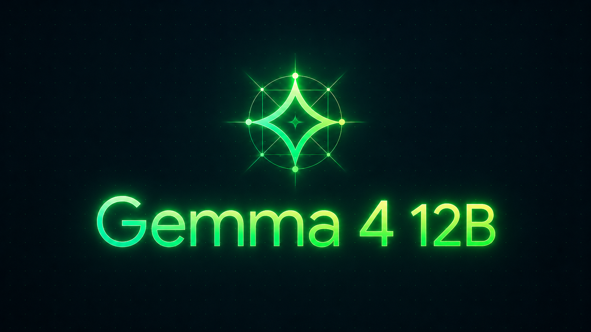

A free model that fits on a laptop wrote my entire dapp, contract and frontend, and then couldn't find a single one of its own bugs.

I work at Monad, and I had a question in mind: can a free, open model you run on your own machine actually build something real for an EVM chain? So I set it up as a test. A local Gemma 4 12B wrote the code, and Claude operated it, sending the prompts and pasting back whatever the compiler complained about. I gave it a game to build.

## The setup

Gemma 4 12B shipped on June 3rd, and the license is now Apache 2.0, so you can do what you like with it. It fits in about 16GB, which meant I could run it on my own machine with llama.cpp, no API key and nothing leaving the laptop. It managed 20 to 40 tokens a second.

The game is last-clicker. You pay a tiny fee to click, and each click resets a short countdown. Whoever clicked last when the timer runs out takes the pot. I built it against Anvil, Foundry's local node.

## What it got right

The game logic was right on the first try. The security surprised me more. Its payout zeroes the pot before sending the money and uses `.transfer()`, the ordering that stops a reentrancy attack, where the recipient calls back in and drains the contract before the balance updates. That is the bug behind the 2016 DAO hack, and I assumed a 12B would reach for the naive version, but it wrote the safe one.

## Where it broke

The first version didn't compile, and the reasons were a tour of how a model fakes fluency. The one that made me laugh: it imported Hardhat into a Foundry project. A couple more were in the same spirit, a constructor declared twice among them. I pasted back only the first error, and it cleared the whole set in one round, which I hadn't expected.

Then it got stuck and stayed there. The tests compiled, but every one reverted on the first click, because the test never gave the player accounts any ether to spend. I handed it the failure. It tried `vm.warp`, then `vm.roll`, convinced the problem was timing, and three rounds later the tests were failing the same way, down to the gas. The revert was sitting in its own output and it could not see the cause.

So I diagnosed it. I told it the accounts were unfunded and to use `vm.deal`, and that got one of three tests green. It still missed the other two, a timer check that never moved the clock forward and a pair of precompile addresses that can't receive ether, and each passed only once I named the exact cause. **It can apply a fix you hand it, but it can't find one on its own.**

The frontend went the same way. I asked for a single page with viem and got a genuinely sharp-looking UI. The web3 layer beneath it was invented, imports that aren't in viem and methods that don't exist on objects it made up. It knows what working code should look like and fills the specifics in with fiction, so I rewrote the wiring myself. The interface was its work, the plumbing was mine.

## The reveal: it was Monad, and it took one line

I never told the model what chain this was for, because there was nothing to tell it. Anvil is just the EVM, and every line it wrote was ordinary EVM code. Once the contract and tests were green, I pointed Foundry at one URL:

```bash
forge create src/LastClicker.sol:LastClicker --rpc-url https://testnet-rpc.monad.xyz --broadcast
```

Foundry read the chain id off the endpoint on its own, and the deploy went through on the first try. Verifying the source on Monad's explorer was one more API call that came back a perfect match. The chain was Monad, and the model never needed to know it, because Monad runs EVM bytecode and the Solidity it already knew was correct. The only Monad-specific detail in the whole build was that one RPC URL, and even the testnet MON for gas came from an agent faucet over an API call.

One honest caveat: forge's linter flagged the timer for leaning on `block.timestamp`, which validators can nudge. That matters more on a one-second chain than a twelve-second one, and you would tighten it before mainnet.

## Play it

It's live on Monad testnet at https://gemma-last-clicker.vercel.app. You'll need a wallet and a little testnet MON. Every click is a real transaction that confirms in about a second and costs a fraction of a cent, which is the only reason a game made of last-second clicks can live entirely on-chain.

So, can a free model on your laptop build a real dapp? Closer than I expected. It produced a safe contract and a clean interface, and it couldn't find one of its own bugs even with a sharper model feeding it the errors. It's a fast junior that can't read a stack trace yet. Good for learning and for things you'll throw away. For anything you would actually deploy, it needs someone sitting next to it.

The repo has the code and every prompt I used: https://github.com/portdeveloper/gemma-last-clicker. The file that finally got it deploying to Monad cleanly is `MONAD_CONTEXT.md` in there. Go build something.
